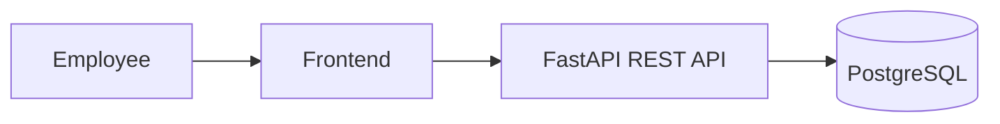
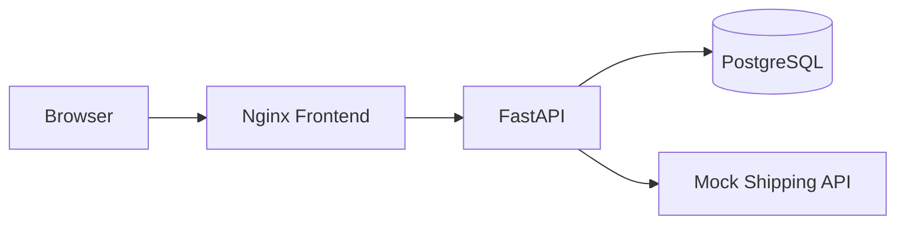
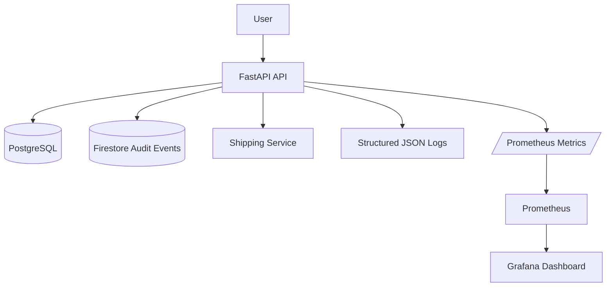
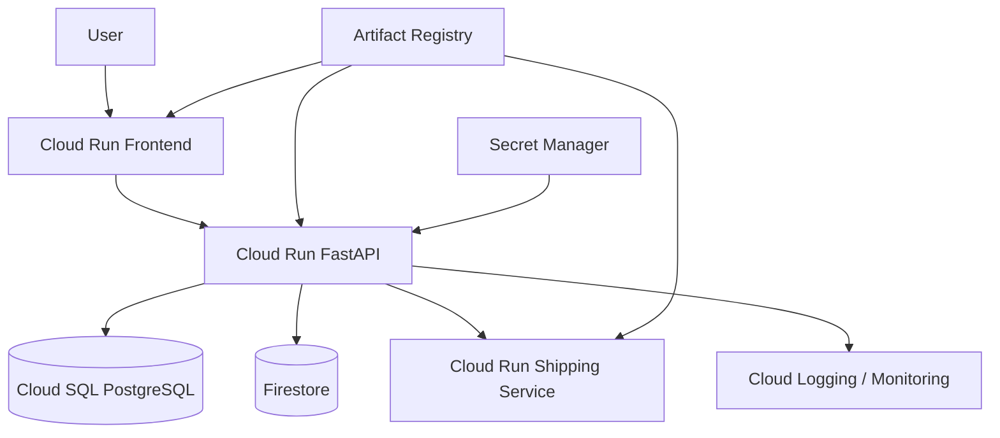

# CloudShift
## Cloud Migration & Troubleshooting Lab

CloudShift is a customer-engineering portfolio project that simulates the migration and operational troubleshooting of a legacy GCC order-management application.

The fictional customer, **GulfSupply Co.**, operates an internal inventory and order platform that began as a single-server application:

```text
Frontend → REST API → PostgreSQL
```

The project approaches the problem as a Cloud / Customer Engineer would:

> assess the existing workload → containerize it → establish a performance baseline → design the Google Cloud migration → add observability → intentionally introduce failures → diagnose root causes → verify remediation.

---

## Public CV evidence

This is a public CloudShift source snapshot from commit `ffc7731db9703298e5cf19d119d346e03fd45a16`.

**[Open the CV evidence and reproduction guide →](docs/CV_EVIDENCE.md)**

The CV's 27.79 ms → 12.38 ms figures come from the recorded Phase 7 PostgreSQL execution-time pair. Raw query plans, all seven scenario logs and a SQL reproduction helper are included. Exact timings vary between runs. Earlier benchmark values elsewhere in these source documents are separate historical runs.

## Project Outcome

CloudShift now includes:

- a working Python/FastAPI order-management API
- PostgreSQL transactional storage
- Docker and Docker Compose local deployment
- a browser frontend
- health checks and Prometheus-format metrics
- a 100,000+ order performance dataset
- SQL query-plan analysis using `EXPLAIN ANALYZE`
- Firestore-emulator audit/event storage
- structured JSON application logs
- Prometheus monitoring
- Grafana operations dashboards
- Cloud Run-style runtime validation
- **7 completed troubleshooting scenarios**
- broken-state and fixed-state evidence for each operational incident

> **Important:** The Google Cloud architecture is deployment-ready and validated against Cloud Run-style runtime requirements, but this repository does not claim a live Cloud Run / Cloud SQL deployment. The project intentionally uses a zero-cost local validation path.

---

# Customer Scenario

GulfSupply Co. is a fictional GCC B2B distributor whose internal order-management system runs on aging infrastructure.

As transaction volume increases, employees experience:

- degraded API response times
- intermittent operational failures
- database performance issues
- dependency failures
- weak visibility into system behavior

The target architecture is designed for Google Cloud using:

```text
Cloud Run
Cloud SQL for PostgreSQL
Firestore
Artifact Registry
Secret Manager
Cloud Logging / Monitoring
```

The implementation in this repository validates the application and operational model locally without creating billable cloud resources.

---

# Architecture

## Original Application



## Containerized Local System



## Observability Architecture



## Target Google Cloud Architecture



Detailed architecture: [`docs/architecture.md`](docs/architecture.md)

---

# Application API

Core endpoints:

```http
GET  /health
GET  /metrics

GET  /customers/{id}
GET  /products
GET  /products/{id}

POST /orders
GET  /orders/{id}
GET  /customers/{id}/orders

GET  /orders/{id}/shipping-quote

GET  /audit-events
GET  /orders/{id}/audit-events
```

Example:

```bash
curl -X POST http://localhost:8080/orders \
  -H "Content-Type: application/json" \
  -d '{
    "customer_id": 1,
    "items": [
      {
        "product_id": 1,
        "quantity": 2
      }
    ]
  }'
```

---

# Technologies

## Application

- Python
- FastAPI
- SQLAlchemy
- PostgreSQL
- REST / HTTP / JSON

## Infrastructure

- Docker
- Docker Compose
- Linux shell tooling
- Nginx

## Google Cloud Migration Design

- Cloud Run
- Cloud SQL for PostgreSQL
- Firestore
- Artifact Registry
- Secret Manager
- IAM
- Cloud Logging
- Cloud Monitoring

## Observability

- structured JSON logs
- Prometheus
- Grafana
- application health checks
- latency histograms
- dependency metrics
- audit/event documents

---

# Performance Engineering

The original local baseline was measured using:

```text
1,000 requests
50 concurrent workers
```

| Metric | Local Baseline |
|---|---:|
| Successful | 1,000 |
| Failed | 0 |
| Error rate | 0.00% |
| Average latency | 615.01 ms |
| Median latency | 589.25 ms |
| P95 | 1090.02 ms |
| P99 | 1449.36 ms |
| Throughput | 78.83 req/s |

The Cloud Run-style local simulation also handled:

```text
1,000 / 1,000 successful requests
50 concurrency
0 failures
```

with approximately:

| Metric | Cloud-Style Simulation |
|---|---:|
| Average latency | 1079 ms |
| P95 | 1971 ms |
| P99 | 2480 ms |
| Throughput | 45.5 req/s |

These values should **not** be interpreted as a Google Cloud performance comparison because the cloud-style environment is still executed locally on Docker.

---

# Database Performance Investigation

A dataset containing more than **100,000 orders** was generated to investigate order-history performance.

## Before Optimization

PostgreSQL used:

```text
Seq Scan on orders
Rows Removed by Filter: 75,002
Rows Returned: 25,000
Execution Time: 25.068 ms
```

Application benchmark:

```text
Average: 70.86 ms
P95:     99.81 ms
```

## Root Cause

The query:

```sql
SELECT id, customer_id, status, created_at
FROM orders
WHERE customer_id = ?
ORDER BY created_at DESC;
```

did not have an index aligned with both the filter and sort pattern.

## Remediation

```sql
CREATE INDEX idx_orders_customer_created_at
ON orders (customer_id, created_at DESC);
```

## After Optimization

```text
Index Scan using idx_orders_customer_created_at
Execution Time: 13.933 ms
```

Application benchmark:

```text
Average: 64.00 ms
P95:     83.71 ms
```

Database execution time improved by approximately **44%**.

The investigation also identified a second architectural issue: the endpoint can return 25,000 rows, making pagination the next optimization layer.

---

# Troubleshooting Cases Resolved: 7

| # | Incident | Symptom | Root Cause | Primary Evidence |
|---|---|---|---|---|
| 01 | Bad Environment Variable | API unavailable after deployment | incorrect PostgreSQL DB name | container logs + env inspection + DB validation |
| 02 | API Timeout | shipping requests return 504 | downstream dependency exceeds timeout budget | request timing + timeout metrics + logs |
| 03 | Incorrect HTTP Status | missing order reported as success | API returned HTTP 200 for error state | HTTP inspection + regression tests |
| 04 | Container Configuration | container runs but API unreachable | service bound to `127.0.0.1` | process config + internal/external probes |
| 05 | Database Bottleneck | order lookup slows as data grows | missing composite index | `EXPLAIN ANALYZE` + benchmarks |
| 06 | API Authentication Failure | shipping integration fails | incorrect Bearer token | upstream 401 + auth logs + metrics |
| 07 | Connection Pool Saturation | traffic spike produces 503s | insufficient DB connection capacity | concurrent load test + pool timeout logs |

Each incident has:

```text
customer symptom
→ reproduction
→ evidence
→ hypothesis
→ root cause
→ remediation
→ verification
```

Phase 7 also re-runs these incidents through the observability stack and stores broken/fixed operational evidence in:

```text
cloud/phase7/evidence/
```

See: [`cloud/phase7/PHASE7_RESULTS.md`](cloud/phase7/PHASE7_RESULTS.md)

---

# Firestore / NoSQL Design

PostgreSQL remains the system of record for:

```text
customers
products
orders
order_items
```

Firestore is used for append-oriented operational audit events such as:

```json
{
  "event_type": "ORDER_CREATED",
  "order_id": 1042,
  "customer_id": 3,
  "environment": "phase6",
  "outcome": "success"
}
```

Other event types include:

```text
SHIPPING_QUOTE_SUCCEEDED
SHIPPING_TIMEOUT
SHIPPING_AUTH_FAILURE
SHIPPING_REQUEST_FAILURE
```

This demonstrates a deliberate **SQL + NoSQL** architecture rather than replacing relational data with NoSQL unnecessarily.

---

# Observability

CloudShift emits structured JSON logs containing fields such as:

```text
severity
message
timestamp
service
environment
request_id
http_method
http_path
http_status
latency_ms
order_id
dependency
```

Prometheus metrics include:

```text
cloudshift_requests_total
cloudshift_request_duration_seconds
cloudshift_errors_total

cloudshift_dependency_requests_total
cloudshift_dependency_duration_seconds

cloudshift_audit_events_total
cloudshift_firestore_write_duration_seconds
```

Grafana provides operational views for:

- request rate
- HTTP errors
- API P95 latency
- shipping dependency latency
- audit event counts
- Firestore write latency

Observability runbook: [`cloud/phase6/OBSERVABILITY_RUNBOOK.md`](cloud/phase6/OBSERVABILITY_RUNBOOK.md)

---

# Migration Readiness

CloudShift's container has been validated against Cloud Run-style runtime expectations:

- listens on `0.0.0.0`
- consumes the runtime `$PORT`
- remains stateless
- externalizes persistent data
- uses environment-driven configuration
- exposes health and metrics endpoints
- implements dependency timeouts
- uses database connection pooling
- supports structured stdout logging

Production migration design: [`cloud/phase5-zero-cost/GCP_DEPLOYMENT_BLUEPRINT.md`](cloud/phase5-zero-cost/GCP_DEPLOYMENT_BLUEPRINT.md)

---

# Repository Structure

```text
cloudshift/
├── app/
│   ├── main.py
│   ├── models.py
│   ├── database.py
│   ├── schemas.py
│   ├── config.py
│   ├── audit.py
│   ├── metrics.py
│   └── logging_config.py
│
├── frontend/
├── mock_shipping/
│
├── scripts/
│   ├── seed_database.py
│   ├── bulk_seed.py
│   ├── load_test.py
│   ├── http_load_test.py
│   └── analyze_customer_orders.py
│
├── scenarios/
│   ├── 01-bad-environment-variable/
│   ├── 02-api-timeout/
│   ├── 03-incorrect-http-status/
│   ├── 04-container-configuration/
│   ├── 05-database-bottleneck/
│   ├── 06-api-authentication-failure/
│   └── 07-traffic-connection-pool/
│
├── cloud/
│   ├── phase5-zero-cost/
│   ├── phase6/
│   ├── phase7/
│   └── phase8/
│
├── docs/
│   ├── architecture.md
│   ├── migration-story.md
│   ├── troubleshooting-scoreboard.md
│   ├── interview-guide.md
│   └── portfolio-copy.md
│
├── Dockerfile
├── docker-compose.yml
└── README.md
```

---

# Running the Core Application

```bash
docker compose up --build -d
```

Seed:

```bash
docker compose exec api python -m scripts.seed_database
```

Health:

```bash
curl http://localhost:8000/health
```

Swagger:

```text
http://localhost:8000/docs
```

---

# Running the Observability Environment

See [`cloud/phase6/README.md`](cloud/phase6/README.md).

Main commands:

```bash
bash cloud/phase6/01-start-firestore.sh
bash cloud/phase6/02-start-stack.sh
bash cloud/phase6/03-seed.sh
bash cloud/phase6/04-generate-observability-data.sh
bash cloud/phase6/05-verify.sh
```

Then:

```text
Grafana:    http://localhost:3001
Prometheus: http://localhost:9090
```

---

# Running Operational Validation

```bash
bash cloud/phase7/run-all.sh
```

Evidence is written automatically to:

```text
cloud/phase7/evidence/
```

---

# Customer Engineer Skills Demonstrated

CloudShift is designed to demonstrate evidence for:

- cloud migration planning
- containerization
- REST APIs / HTTP
- Python application engineering
- SQL / PostgreSQL
- NoSQL / Firestore
- Linux troubleshooting
- Docker troubleshooting
- application observability
- performance engineering
- root-cause analysis
- API integration
- authentication troubleshooting
- database indexing
- connection-pool tuning
- load testing
- customer-facing technical explanation

The goal is not simply to say:

> "Strong debugging skills."

The repository contains seven reproducible cases showing **how those debugging skills were applied**.

---

# Interview Summary

A concise explanation of the project:

> CloudShift simulates a customer whose legacy order-management application can no longer reliably support growing traffic. I built and containerized the original FastAPI/PostgreSQL workload, established performance baselines, designed its Google Cloud migration path, added Firestore-style audit storage and a full observability stack, and then created seven production-style incidents covering configuration, latency, HTTP semantics, containers, SQL performance, authentication, and database connection saturation. Each incident includes broken-state evidence, root-cause analysis, remediation, and verification.

See [`docs/interview-guide.md`](docs/interview-guide.md) for the full interview walkthrough.
