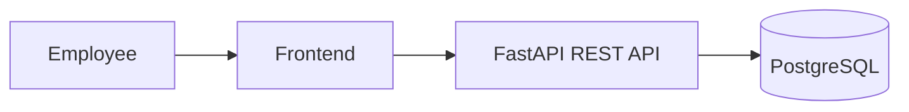
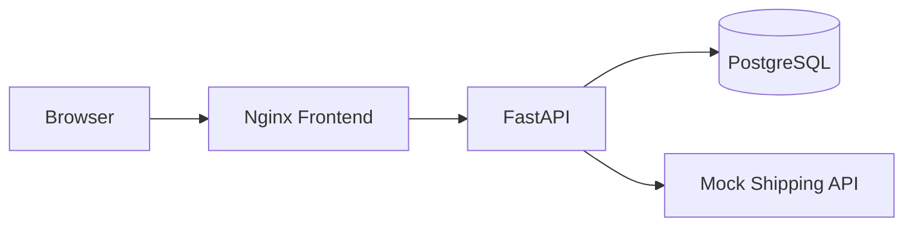
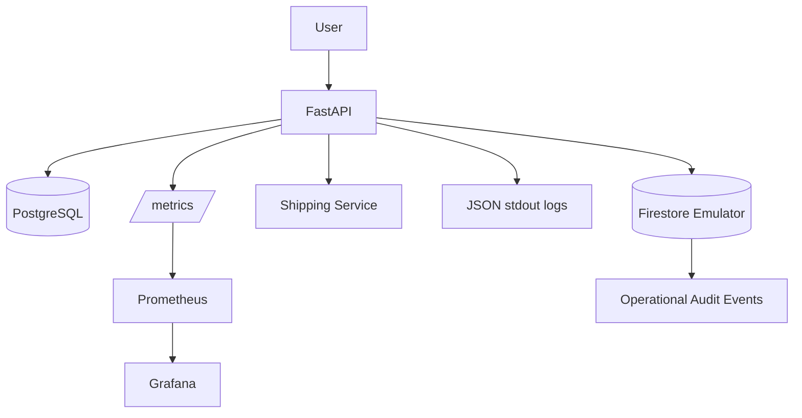
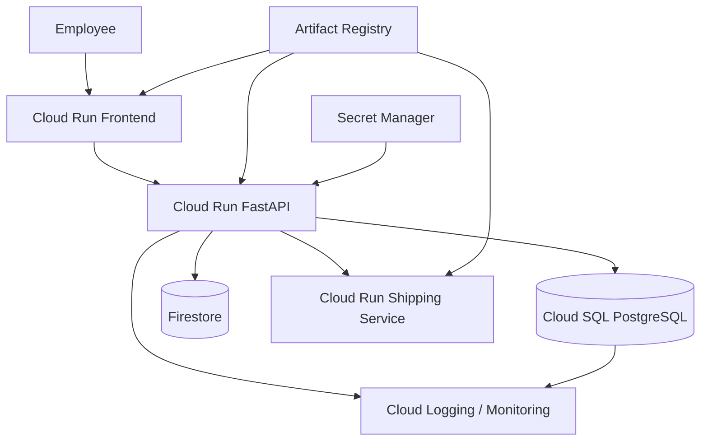

# CloudShift Architecture

## 1. Legacy Source Architecture

Characteristics:

- single application server
- no horizontal scaling
- PostgreSQL hosted with the application environment
- manual deployment
- configuration through environment variables
- limited operational visibility

## 2. Local Container Architecture

Docker Compose provides isolated services and a reproducible runtime.

## 3. Phase 6 Observability Architecture

## 4. Target Google Cloud Architecture

## Component Responsibilities

### Cloud Run API

- stateless application runtime
- REST endpoints
- validation
- order orchestration
- dependency integration
- structured logging
- application metrics

### Cloud SQL PostgreSQL

Transactional system of record:

- customers
- products
- orders
- order items

### Firestore

Document-oriented audit/event data:

- order creation events
- dependency timeout events
- authentication failure events
- shipping success events

### Artifact Registry

Stores immutable application container images.

### Secret Manager

Stores:

- DB credentials
- API tokens
- environment secrets

### Cloud Logging / Monitoring

Production operational signals:

- request logs
- structured application logs
- latency
- errors
- instance state
- dependency health
- DB health

## Key Architectural Decisions

### Keep orders in PostgreSQL

Order/customer data is relational and transactional. Moving it to Firestore purely to demonstrate NoSQL would weaken the design.

### Use Firestore for audit events

Audit records are append-oriented, semi-structured, and naturally represented as documents.

### Make the API stateless

All durable data lives outside the container, making the API compatible with horizontally scalable container runtimes.

### Explicit dependency timeouts

External service calls use bounded timeouts so a degraded dependency cannot indefinitely consume request capacity.

### Control DB connection growth

Cloud Run-style scaling must be coordinated with PostgreSQL connection capacity. Scenario 07 demonstrates why application scaling and DB pooling cannot be designed independently.
